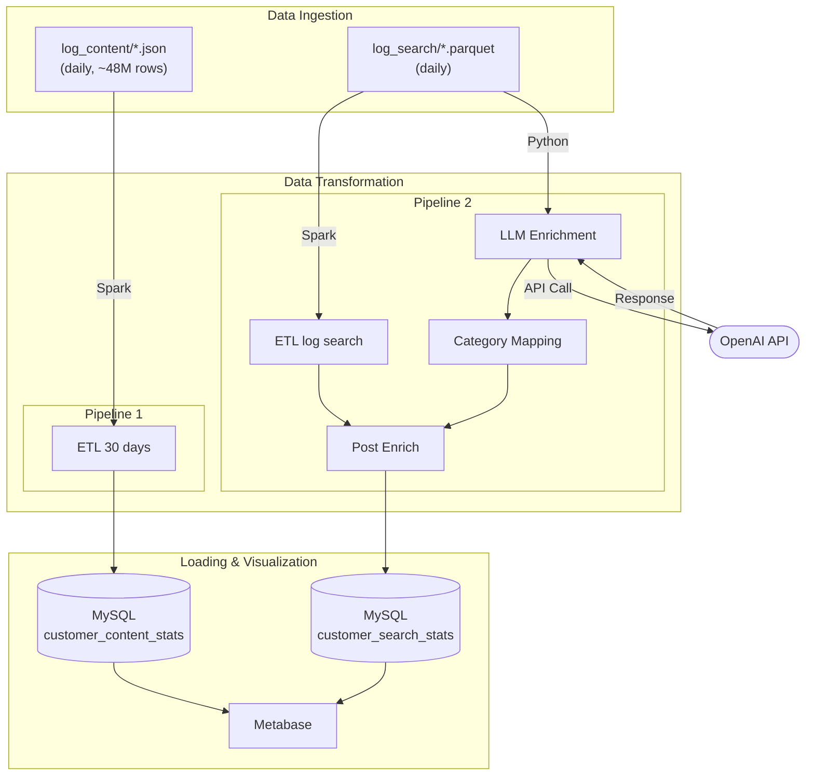
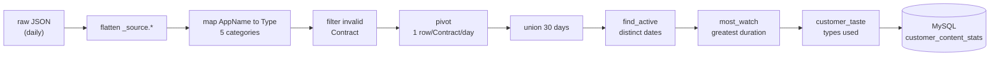
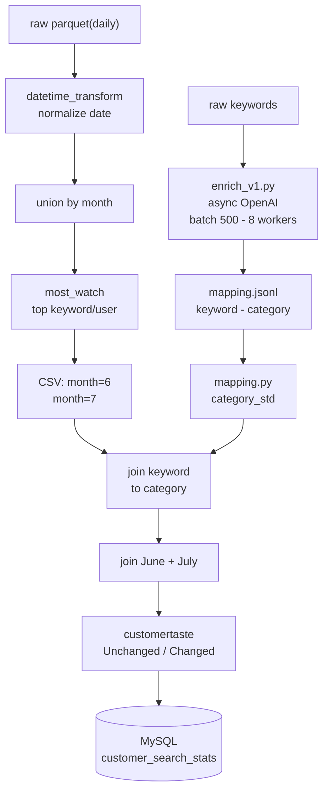

# Big Data Pipeline – OTT Content Analytics

> **Mục tiêu:** Xây dựng end-to-end Big Data pipeline xử lý log xem nội dung và log tìm kiếm của một hệ thống truyền hình OTT, chạy hoàn toàn trên máy cá nhân (không dùng cloud).

---

## Mục lục

1. [Tổng quan](#1-tổng-quan)
2. 
2. [Kiến trúc hệ thống (UML)](#2-kiến-trúc-hệ-thống-uml)
3. [Tech Stack](#3-tech-stack)
4. [Pipeline chi tiết](#4-pipeline-chi-tiết)
   - [Pipeline 1 – log_content ETL](#pipeline-1--log_content-etl)
   - [Pipeline 2 – log_search ETL + LLM Enrichment](#pipeline-2--log_search-etl--llm-enrichment)
5. [Cấu trúc thư mục](#5-cấu-trúc-thư-mục)
6. [Đã làm được](#6-đã-làm-được)
7. [GCP Migration](#7-gcp-migration)
8. [Key Learnings](#8-key-learnings)
9. [Hướng dẫn chạy](#9-hướng-dẫn-chạy)

---

## 1. Tổng quan

Project mô phỏng hệ thống phân tích khách hàng của một nền tảng OTT (Over-The-Top) truyền hình Việt Nam. Dữ liệu bao gồm:

- **log_content**: Log hành vi xem nội dung (phim, thể thao, thiếu nhi...) của từng khách hàng, dạng JSON theo ngày
- **log_search**: Log từ khoá tìm kiếm của người dùng, dạng Parquet theo ngày

Từ raw log, hệ thống tổng hợp ra **customer profile 30 ngày**: mỗi khách hàng xem gì nhiều nhất, tìm kiếm gì, và sở thích có thay đổi theo tháng không.


## 2. Key Learnings

### Apache Spark
- Hiểu **lazy evaluation**: transformation chỉ thực thi khi có action
- `spark.sql.shuffle.partitions` ảnh hưởng lớn đến performance với groupBy/join
- `repartition()` trước khi write giúp kiểm soát số file output
- `unionByName()` an toàn hơn `union()` khi schema có thể khác thứ tự cột
- JDBC write với `batchsize=10000` tăng tốc đáng kể so với mặc định

### Python Async
- `asyncio.Semaphore` để giới hạn concurrent API calls, tránh rate limit
- **Producer–Consumer pattern** với `asyncio.Queue`: tách logic gọi API và ghi file
- Buffered I/O + `os.fsync()` đảm bảo dữ liệu không mất khi crash
- Checkpoint bằng cách đọc file đã ghi → skip những gì đã xử lý (resume-safe)

### Docker & Infrastructure
- Hiểu volume mount giữa host và container (`:z` flag cho SELinux trên Fedora)
- External network `spark-net` để các compose file khác nhau giao tiếp
- JDBC JAR phải được mount vào đúng classpath của Spark executor

### Data Engineering Patterns
- **Grain**: luôn xác định rõ grain của DataFrame trước khi transform
- **Pivot table**: chuyển long format → wide format cho customer-level analytics
- **Window function**: `row_number().over(Window.partitionBy())` để lấy top-1 per group
- **LLM as enrichment layer**: dùng LLM để label unstructured data (keyword → category)

---

## 3. Kiến trúc hệ thống (UML)



---

## 4. Tech Stack

| Nhóm | Công cụ | Mục đích |
|---|---|---|
| **Core Processing** | Apache Spark 3.5.1 (PySpark) | ETL, distributed processing |
| **LLM Enrichment** | OpenAI API (async) | Phân loại keyword tìm kiếm |
| **Storage** | MySQL (LTS) | Serving layer, OLAP |
| **BI & Visualization** | Metabase | Dashboard, ad-hoc query |
| **Prototyping** | Jupyter Notebook, DuckDB | EDA, light-weight transform |
| **Infrastructure** | Docker, Docker Compose | Orchestrate all services |

---

## 5. Pipeline chi tiết

### Pipeline 1 – log_content ETL

**File:** `pipelines/log_content/etl_30_days.py`  
**Input:** `data/raw/log_content/*.json` (1 file/ngày, ~48M rows/30 ngày)  
**Output:** MySQL table `customer_content_stats`



**Schema output (1 row / Contract):**

| Cột | Mô tả |
|---|---|
| `Contract` | Mã khách hàng |
| `Truyen Hinh` | Tổng duration xem truyền hình (30 ngày) |
| `Phim Truyen` | Tổng duration xem phim |
| `Giai Tri` | Tổng duration nội dung giải trí |
| `Thieu Nhi` | Tổng duration nội dung thiếu nhi |
| `The Thao` | Tổng duration thể thao |
| `Active` | Số ngày distinct có hoạt động |
| `MostWatch` | Thể loại xem nhiều nhất |
| `Taste` | Combo thể loại đã dùng (vd: `Truyen Hinh-Phim Truyen`) |

---

### Pipeline 2 – log_search ETL + LLM Enrichment

**Files:** `pipelines/log_search/` (4 scripts)  
**Input:** `data/raw/log_search/*.parquet` + OpenAI API  
**Output:** MySQL table `customer_search_stats`



**Điểm kỹ thuật nổi bật:**
- `enrich_v1.py` dùng **asyncio + Semaphore(8)** để gọi OpenAI song song, tránh rate limit
- **Producer–Consumer pattern**: 8 API workers → Queue → 1 writer_worker (buffered I/O)
- **Checkpoint/resume**: skip keyword đã classified, tránh gọi API lại khi restart
- **Prompt Engineering**: rule-based prompt tiếng Việt, 13 categories, ưu tiên suy luận trước khi fallback `Other`

---

## 6. Cấu trúc thư mục

```
Bigdata/
├── pipelines/
│   ├── log_content/
│   │   └── etl_30_days.py          ← Pipeline 1
│   └── log_search/
│       ├── etl_log_search.py       ← Pipeline 2a: ETL theo tháng
│       ├── enrich_v1.py            ← Pipeline 2b: LLM enrichment (async OpenAI)
│       ├── mapping.py              ← Pipeline 2c: Spark category std
│       └── post_enrich.py          ← Pipeline 2d: join + load MySQL
│
├── notebooks/                      ← EDA & prototyping
│   ├── log_content_eda.ipynb       ← ETL 5-day demo với docstring đầy đủ
│   ├── log_content_prototype.ipynb ← ETL prototype v1 (có Device_Count)
│   ├── log_search_v1.ipynb         ← log search EDA
│   └── enrich.ipynb                ← LLM enrichment test
│
├── warehouse/queries/              ← SQL analysis queries
│
├── infra/
│   ├── spark/
│   │   ├── docker-compose.yaml     ← 1 master + 1 worker
│   │   └── Dockerfile              ← custom Spark image (MySQL JDBC baked in)
│   ├── mysql/
│   │   ├── docker-compose.yaml
│   │   └── init/                   ← init SQL scripts
│   ├── metabase/
│   │   └── docker-compose.yaml     ← BI dashboard
│   └── jupyter/
│       └── docker-compose.yaml
│
├── docs/                           ← Tài liệu kỹ thuật
├── .env                            ← API keys, DB credentials
├── .gitignore
└── README.md
```

---

## 7. Đã làm được

### Infrastructure
- [x] Dựng Spark cluster local bằng Docker (1 master + 2 workers)
- [x] Cấu hình MySQL với healthcheck, utf8mb4, connection pool
- [x] Setup Metabase kết nối MySQL để visualize
- [x] Cấu hình Jupyter Notebook với Spark kernel

### Pipeline 1 – log_content
- [x] Đọc và xử lý 48M rows JSON → 1.9M rows sau aggregate
- [x] Transform: flatten nested JSON, map AppName → category
- [x] Tính `Active`, `MostWatch`, `Taste` cho mỗi khách hàng
- [x] Load vào MySQL qua JDBC (batch insert 10K rows)
- [x] Refactor qua 3 versions, version cuối có docstring đầy đủ

### Pipeline 2 – log_search
- [x] ETL log search theo ngày → tổng hợp theo tháng
- [x] Tìm keyword được search nhiều nhất của từng user (`mostWatch`)
- [x] LLM enrichment với OpenAI: phân loại ~unique keywords thành 13 categories
- [x] Async pipeline với checkpoint/resume (không gọi API lại)
- [x] Join 2 tháng, tạo cột `taste` (Unchanged/Changed)
- [x] Load kết quả vào MySQL

### Project Organization
- [x] Tái cấu trúc project từ flat → pipeline-based layout
- [x] Xóa deprecated ETL versions (v1, v2)
- [x] Gitignore logs, data, venv
- [x] Viết README đầy đủ với Mermaid diagrams


## 8. GCP Migration (planned)

> **Mục tiêu:** Chuyển toàn bộ pipeline lên GCP — giữ nguyên logic ETL, không cần viết lại code, chỉ đổi config và output target.

| Hiện tại (Local Docker) | GCP |
|---|---|
| `/data/raw/` (local disk) | **Cloud Storage (GCS)** `gs://bucket/raw/` |
| Spark cluster (Docker Compose) | *None* |
| MySQL (Docker) | **BigQuery** |
| Metabase | **Looker Studio** (free, connect thẳng BigQuery) |
| Chạy thủ công | **Cloud Composer** (Airflow managed) |

---

## 9. Hướng dẫn chạy

### Khởi động services

```bash
# Spark cluster
docker compose -f infra/spark/docker-compose.yaml up -d

# MySQL
docker compose -f infra/mysql/docker-compose.yaml up -d

# Metabase (optional)
docker compose -f infra/metabase/docker-compose.yaml up -d
```

### Chạy Pipeline 1 – log_content

```bash
docker exec spark-master /opt/spark/bin/spark-submit \
  --master spark://spark-master:7077 \
  --deploy-mode client \
  /code/pipelines/log_content/etl_30_days.py
```

### Chạy Pipeline 2 – log_search

```bash
# Bước 1: ETL log search
docker exec spark-master /opt/spark/bin/spark-submit \
  --master spark://spark-master:7077 \
  --deploy-mode client \
  /code/pipelines/log_search/etl_log_search.py

# Bước 2: LLM enrichment (local, cần .env với OPENAI_API_KEY)
# Data đã enrich sẵn — bước này chỉ cần chạy lại khi có keyword mới
source .venv/bin/activate
python pipelines/log_search/enrich_v1.py

# Bước 3: Spark category mapping
docker exec spark-master /opt/spark/bin/spark-submit \
  --master spark://spark-master:7077 \
  --deploy-mode client \
  /code/pipelines/log_search/mapping.py

# Bước 4: Post enrich + load MySQL
docker exec spark-master /opt/spark/bin/spark-submit \
  --master spark://spark-master:7077 \
  --deploy-mode client \
  /code/pipelines/log_search/post_enrich.py
```
---

*Project đang trong giai đoạn học tập và phát triển liên tục.*
