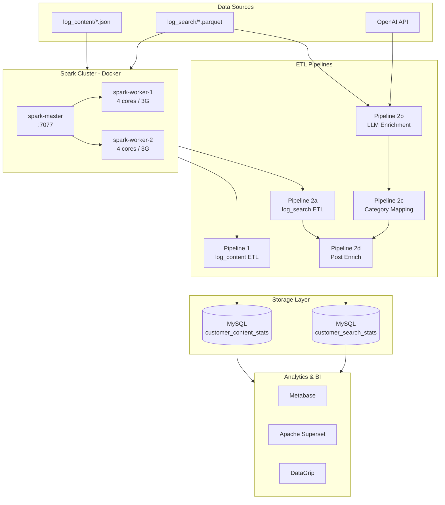
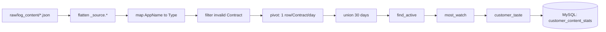
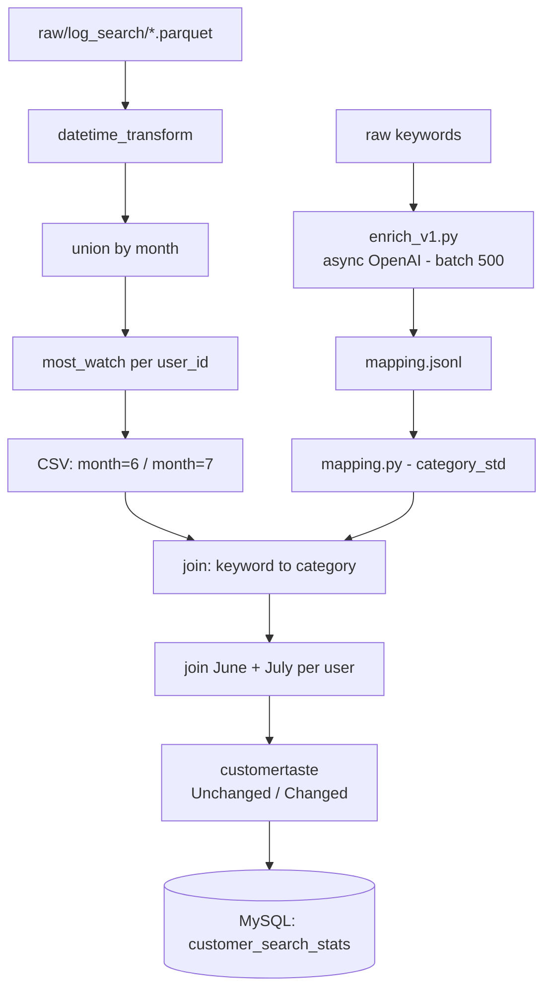

# Big Data Tutorial

> Hướng dẫn Big Data từ A–Z, bao gồm các công cụ phổ biến trong hệ sinh thái Big Data: Spark, Kafka, Cassandra, Superset, Airflow, Docker...
>
> **Lưu ý:** Toàn bộ project chạy trên máy tính cá nhân, không dùng cloud.

---

## Mục lục

1. [Kiến trúc](#kiến-trúc)
2. [Tech Stack](#tech-stack)
3. [Data Flow](#data-flow)
4. [Folder Structure](#folder-structure)
5. [Run Instructions](#run-instructions)
6. [Author](#author)

---

## Kiến trúc

Project xử lý **log xem nội dung** và **log tìm kiếm** của một hệ thống truyền hình OTT, với 2 pipeline ETL độc lập, chạy trên Spark cluster (Docker) và nạp kết quả vào MySQL.



---

## Tech Stack

| Category | Tools |
|---|---|
| Core Processing | Apache Spark (PySpark), Apache Airflow |
| Storage | MySQL, Cassandra |
| LLM Enrichment | OpenAI API (async, batch) |
| BI & Visualization | Apache Superset, Metabase |
| Prototyping | Jupyter Notebook, DuckDB, Polars |
| Infrastructure | Docker, Docker Compose, Linux (Fedora) |
| Source Control | Git, GitHub |
| IDEs | VS Code, DataGrip |

---

## Data Flow

### Pipeline 1 – `log_content` (ETL 30 days)



### Pipeline 2 – `log_search` (ETL + LLM Enrichment)



---

## Folder Structure

```
Bigdata/
├── pipelines/
│   ├── log_content/
│   │   └── etl_30_days.py          ← Pipeline 1: 30-day content ETL
│   └── log_search/
│       ├── etl_log_search.py       ← Pipeline 2a: daily log → monthly summary
│       ├── enrich_v1.py            ← Pipeline 2b: LLM keyword enrichment
│       ├── mapping.py              ← Pipeline 2c: Spark category standardization
│       └── post_enrich.py          ← Pipeline 2d: join + final output
│
├── notebooks/                      ← EDA & prototyping (Jupyter)
│   ├── class 5.ipynb
│   ├── log_search_v1.ipynb
│   ├── enrich.ipynb
│   └── ...
│
├── infra/
│   ├── spark/
│   │   ├── docker-compose.yaml     ← Spark cluster (1 master, 2 workers)
│   │   └── jars/                   ← MySQL JDBC + extra JARs
│   └── mysql/                      ← MySQL config / init scripts
│
├── warehouse/
│   └── queries/                    ← SQL queries for analysis
│
├── docs/                           ← Documentation, flowcharts
├── data/                           ← Raw & processed data (gitignored)
├── .env                            ← OPENAI_API_KEY, DB credentials
├── .gitignore
└── README.md
```

---

## Run Instructions

### 1. Start Spark cluster

```bash
cd infra/spark
docker compose up -d
```

### 2. Run Pipeline 1 – log_content ETL

```bash
docker exec spark-master spark-submit \
  /code/pipelines/log_content/etl_30_days.py
```

### 3. Run Pipeline 2a – log_search ETL

```bash
docker exec spark-master spark-submit \
  /code/pipelines/log_search/etl_log_search.py
```

### 4. Run LLM Enrichment (local Python)

```bash
source .venv/bin/activate
python pipelines/log_search/enrich_v1.py
```

### 5. Run Spark category standardization

```bash
docker exec spark-master spark-submit \
  /code/pipelines/log_search/mapping.py
```

### 6. Run post-enrich & load to MySQL

```bash
docker exec spark-master spark-submit \
  /code/pipelines/log_search/post_enrich.py
```

---

## Author

Self-learning Big Data project – running entirely on personal hardware.
