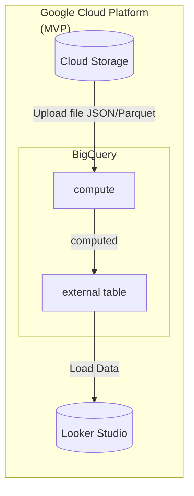

# Big Data Project - OTT Log Analytics Pipeline

Xem hướng dẫn thực thi local tại [README.md](local/README.md)

---

## Lộ trình Chuyển đổi GCP MVP (Serverless)

### 1. Kiến trúc chuyển đổi Tech Stack sang GCP
| Thành phần | Local/Docker | **GCP MVP (Serverless)** |
| :--- | :--- | :--- |
| **Storage (Data Lake)** | Local Disk | **Google Cloud Storage (GCS)** |
| **Data Warehouse & Processing** | Spark on Docker | **BigQuery (SQL-based)** |
| **Serving Layer** | MySQL (Docker) | **BigQuery** |
| **Visualization (BI)** | Metabase (Local) | **Looker Studio** |
| **Orchestration** | Manual / Scripts | **BigQuery Jobs / Scheduled Queries** |

---

### 2. Checklist Thực hiện MVP

#### Giai đoạn 1: Chuẩn bị Data Lake (GCS) 
*   [x] **Tạo Bucket:** Đã tạo bucket `bigdata-proj` tại Singapore (`asia-southeast1`).
*   [x] **Phân cấp Folder:** Tạo folder `raw/` để chứa các file thô, `final/` để chứa file đã xử lý.

> Đã hoàn thành

#### Giai đoạn 2: Kho dữ liệu & Xử lý (BigQuery)

*   [x] **Tạo schema, table:** Tạo schema cho BigQuery và tạo table từ schema.

*   [x] **Chỉnh sửa Pipeline:** refactor ETL_log_search.py và ETL_30_days.py thành [ETL-30-days.sql](cloud/queries/log_content/ETL-30-days.sql) và [ETL-log-search.sql](cloud/queries/log_search/ETL-log-search.sql).

*   [x] **Chỉnh sửa Pipeline (pt.2):** Chuyển đổi logic lại của 3 file [mapping.py](local/pipelines/log_search/mapping.py), [enrich_v1.py](local/pipelines/log_search/enrich_v1.py) và [post_enrich.py](local/pipelines/log_search/post_enrich.py) thành SQL scripts.

> Đã hoàn thành

#### Giai đoạn 3: Trực quan hóa (Looker Studio)
*   [ ] **Kết nối nguồn dữ liệu:** Kết nối Looker Studio với BigQuery.
*   [ ] **Chọn bảng:** Trỏ tới đúng Project -> Dataset -> Table/View.
*   [ ] **Thiết kế Dashboard:** Kéo thả các biểu đồ phân tích thời lượng, hành vi người dùng.

#### Giai đoạn 4: Quản lý chi phí & Tự động hóa
*   [ ] **Budget Alert:** Cài đặt cảnh báo để kiểm soát 7.8M credit.
*   [ ] **Tối ưu hóa:** Sử dụng mô hình chi phí "On-demand".

### 3. Hình ảnh minh họa

