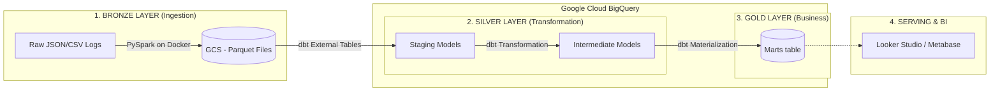
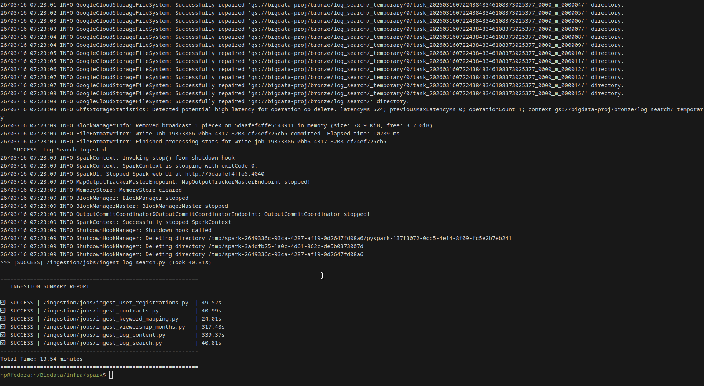
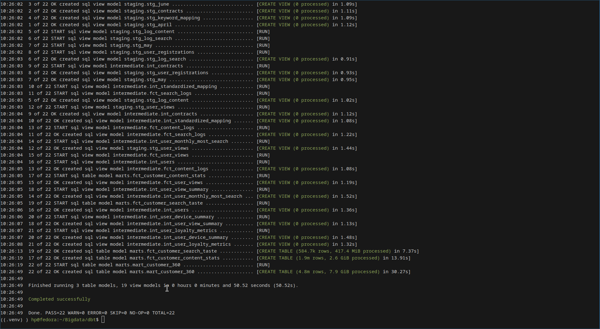
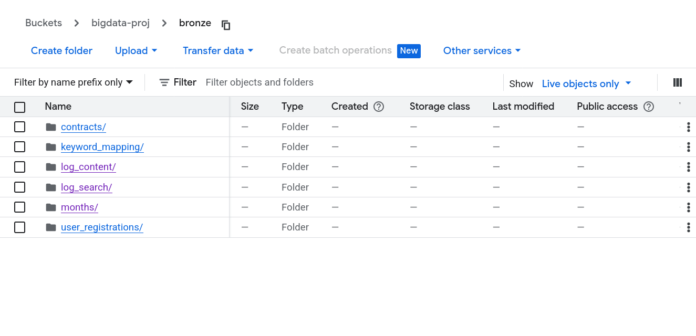
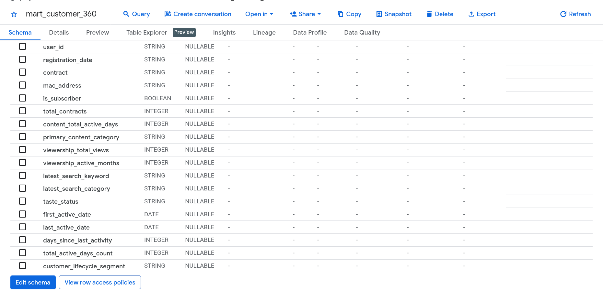

# Dự Án Big Data: OTT Log Analytics Pipeline (GCP Transition)

Dự án này đánh dấu bước chuyển đổi từ kiến trúc xử lý dữ liệu cục bộ sang hệ sinh thái Big Data hiện đại trên Google Cloud Platform (GCP), sử dụng mô hình Medallion Architecture.

---

## Mục Lục (Outline)
1. [Kiến Trúc Hệ Thống (Medallion Architecture)](#1-kiến-trúc-hệ-thống-medallion-architecture)
2. [Yêu Cầu Môi Trường (Requirements)](#2-yêu-cầu-môi-trường-requirements)
3. [Cấu Trúc Thư Mục](#3-cấu-trúc-thư-mục)
4. [Lộ Trình Triển Khai (Timeline)](#4-lộ-trình-triển-khai-timeline)
5. [Trạng Thái Hoàn Thành Chi Tiết](#5-trạng-thái-hoàn-thành-chi-tiết)
6. [Bài Học Kinh Nghiệm (Key Learnings)](#6-bài-học-kinh-nghiệm-key-learnings)
7. [Hướng Dẫn Chạy Dự Án (Commands to Run)](#7-hướng-dẫn-chạy-dự-án-commands-to-run)
8. [Kết Quả Đầu Ra (Output)](#8-kết-quả-đầu-ra-output)

---

## 1. Kiến Trúc Hệ Thống (Medallion Architecture)

Sử dụng kết hợp PySpark để xử lý dữ liệu thô (Ingestion) và dbt để biến đổi dữ liệu (Transformation) ngay trên BigQuery.


```mermaid
graph LR 

    subgraph Bronze ["1. BRONZE LAYER (Ingestion)"]
        direction LR
        A[Raw JSON/CSV Logs] -->|PySpark on Docker| B[(GCS - Parquet Files)]:::storage
    end

    subgraph BQ ["Google Cloud BigQuery"]
        direction LR
        
        subgraph Silver ["2. SILVER LAYER (Transformation)"]
            direction LR
            C[Staging Models]:::compute -->|dbt Transformation| D[Intermediate Models]:::compute
        end

        subgraph Gold ["3. GOLD LAYER (Business)"]
            direction LR
            D -->|dbt Materialization| E[(Marts table)]:::storage
        end
    end

    subgraph Serving ["4. SERVING & BI"]
        direction LR
        F[Looker Studio / Metabase]:::bi
    end

    B -->|dbt External Tables| C
    E -.-> F


```

---

## 2. Yêu Cầu Môi Trường (Requirements)

Để chạy dự án, hệ thống cần đáp ứng các thành phần sau:

### Phầm mềm và Công cụ
- Python 3.10+
- Apache Spark (PySpark) được cài đặt và cấu hình sử dụng GCS Connector (`gcs-connector:hadoop3`).
- dbt-core và dbt-bigquery phiên bản 1.11.1 trở lên.
- dbt-external-tables (Package dbt để quản lý External Tables BQ).
- Google Cloud SDK (gcloud CLI).

### Quyền hạn GCP (IAM Roles)
Cần có một Project trên Google Cloud và gán quyền đúng mức:
- Storage Object Admin (Quyền cho Spark upload dữ liệu thô lên GCS).
- BigQuery Data Editor, BigQuery Job User (Quyền cho dbt thao tác tạo/xóa bảng trên BigQuery).

### Chuẩn bị môi trường Python ảo (Virtual Environment)
```bash
python -m venv .venv
source .venv/bin/activate
pip install -r requirements.txt
```

---

## 3. Cấu Trúc Thư Mục

```
Bigdata
├── README.md
├── requirements.txt
├── run_all_ingestion.py                        # All Ingestion
├── data/
│   └── raw/
│       ├── contracts/
│       ├── log_content/
│       ├── log_search/
│       ├── mapping/
│       ├── months/
│       └── users/
├── dbt/                                        # Transformation logic
│   ├── dbt_project.yml
│   ├── package-lock.yml
│   ├── packages.yml
│   ├── profiles.yml
│   ├── dbt_internal_packages/
│   │   ├── dbt-adapters/
│   │   └── dbt-bigquery/
│   ├── dbt_packages/
│   │   ├── dbt_external_tables/
│   │   └── dbt_utils/
│   ├── macros/
│   │   └── generate_schema_name.sql
│   ├── models/
│   │   ├── intermediate/
│   │   ├── marts/
│   │   └── staging/
├── docs/                                       # Documentation
├── duckdb/
│   ├── analytics.duckdb
│   ├── mydatabase.duckdb                       # Database
│   └── dbt/                                    # Transformation logic
├── images/                                     # Output
├── infra/
│   ├── jupyter/                                # EDA tools
│   ├── metabase/                               # BI tools
│   └── spark/                                  # Processing tools
├── ingestion/
│   ├── jars/
│   ├── jobs/
│   ├── schemas/
│   └── utils/
├── notebooks/                                  # EDA
├── scripts/
│   ├── legacy/                                 # Deprecated
│   │   ├── enrich_data.py
│   │   ├── etl_30_days.py
│   │   ├── etl_log_search.py
│   │   ├── mapping.py
│   │   └── ...
```

---

## 4. Lộ Trình Triển Khai (Timeline)

| Giai đoạn | Nội dung | Trạng thái |
| :--- | :--- | :--- |
| Giai đoạn 1 | Ingestion & Schema Enforcement (PySpark + GCS) | Hoàn thành |
| Giai đoạn 2 | Xây dựng Silver Layer (dbt Staging & Intermediate) | Hoàn thành |
| Giai đoạn 3 | Tối ưu hóa Gold Layer (Customer 360 & Analytics) | Hoàn thành |
| Giai đoạn 4 | Trực quan hóa dữ liệu (Looker Studio) | Đang thực hiện |

---

## 5. Trạng Thái Hoàn Thành Chi Tiết

### 1. Ingestion (Bronze Layer)
- Công nghệ: PySpark chạy trên Docker.
- Kết quả: Chuyển đổi toàn bộ dữ liệu từ định dạng JSON/CSV sang định dạng Parquet để tối ưu dung lượng và tốc độ truy vấn truy xuất.
- Xử lý sự cố: Đã giải quyết tình trạng cạn kiệt bộ nhớ OutOfMemory (OOM) bằng việc cấp lượng lớn Driver Memory và phân đoạn `upload.chunk.size` cho cấu hình GCS.

### 2. Transformation (Silver & Gold Layer)
- Công nghệ: dbt (Data Build Tool) kết hợp BigQuery.
- Staging: Thiết lập thành công các cấu hình External Tables trỏ thẳng vào dataset Parquet lưu trữ ở GCS. 
- Intermediate: Gom chung logic vào Spine định danh, xử lý toàn bộ UNION tập trung thành chuẩn DISTINCT duy nhất.
- Marts (Gold): Xây dựng khối `mart_customer_360`, kết cấu tóm tắt vòng đời hành vi người xem theo logic mảng tiên tiến.

---

## 6. Bài Học Kinh Nghiệm (Key Learnings)

1. Spark Memory Management: Khi chạy Spark trong môi trường container, các cấu hình nhúng bằng `.config()` trong file code thường không có tác dụng. Buộc phải thiết lập `--driver-memory` ngay từ lời gọi `spark-submit` ban đầu.
2. GCS Connector OOM: Đẩy file lớn lên Google Cloud Storage có thể làm sụp đổ Node nếu không chia nhỏ dung lượng upload tại tham số `fs.gs.outputformat.upload.chunk.size`.
3. dbt External Tables trên BigQuery: Khai báo định dạng file Parquet phải nằm gọn bên trong tag `options` thay vì định dạng DuckDB truyền thống.
4. Schema Enforcement: Ràng buộc khung kiểu dữ liệu cố định trong PySpark giảm hàng loạt lỗi SQL về sau. Nhưng với dữ liệu đã lưu sẵn bằng dạng Parquet thì nền tảng tự động có schema, việc cưỡng ép thêm sẽ gây lỗi kiểu Array/List phức hợp.
5. Cú Pháp GoogleSQL vs DuckDB: Tránh dùng nhầm lẫn các hàm xử lý. BQ cần `PARSE_DATE` thay vì `strptime`, xử lý mảng nối dây chuỗi sẽ chuộng `ARRAY_TO_STRING` thay cho `CONCAT_WS` và quan trọng về việc rạch ròi kiểu dữ liệu (`SAFE_CAST`).

---

## 7. Hướng Dẫn Chạy Dự Án (Commands to Run)

### Bước 1: Xác Thực Dịch Vụ GCP
Đăng nhập tài khoản Local Application thông qua Cloud SDK để xác thực vào GCS và BQ:
```bash
gcloud auth application-default login
```

### Bước 2: Chạy lớp PySpark Ingestion (Đẩy dữ liệu lên GCS)
Sử dụng công cụ `spark-submit` có cấp cấu hình Connector Cloud bổ sung. Ví dụ ingest bộ dataset `log_search`:
```bash
export GCS_BRONZE_BUCKET="gs://bigdata-proj"
spark-submit \
  --driver-memory 4g \
  --packages com.google.cloud.bigdataoss:gcs-connector:hadoop3-2.2.8 \
  ingestion/jobs/ingest_log_search.py
```

### Bước 3: Cài Đặt Các Phụ Thuộc dbt
Kích hoạt môi trường trong thư mục chứa dbt để tải thư viện (như dbt_utils và dbt_external_tables):
```bash
cd dbt
dbt deps
```

### Bước 4: Tạo External Tables (BigQuery -> GCS)
Lệnh Operation này sẽ quét toàn bộ định nghĩa trong thư mục staging (`_sources.yml`) để tạo DDL ghim thẳng vào bucket GCS. (Chạy một lần mồi hoặc khi thay đổi path gcs).
```bash
dbt run-operation stage_external_sources
```

### Bước 5: Biên Dịch và Chạy Full Transformation
Kiểm tra tính tuân thủ của các SQL script trước khi thực sự cấp bảng (table/view) ở BQ:
```bash
# Compile syntax (chỉ dịch Jinja / SQL và test error cú pháp)
dbt compile

# Khởi tạo toàn bộ mô hình (Staging -> Intermediate -> Marts)
dbt run
```

---

## 8. Kết Quả Đầu Ra (Output)

### Hình ảnh Ingestion
Dưới đây là các minh chứng cho việc thực thi Pipeline thành công:

* Spark Ingestion Success: 

* dbt Build Result:

* GCS Storage Structure: 

* marts demo:



---
Cập nhật lần cuối: 16/03/2026
