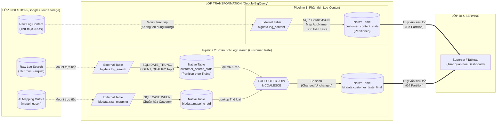

```mermaid
flowchart LR

    subgraph Ingestion ["LỚP INGESTION (Google Cloud Storage)"]
        direction TB
        GCS_LC[("Raw Log Content<br/>(Thư mục JSON)")]:::gcs
        GCS_LS[("Raw Log Search<br/>(Thư mục Parquet)")]:::gcs
        GCS_Map[("AI Mapping Output<br/>(mapping.json)")]:::gcs
    end

    subgraph Transform ["LỚP TRANSFORMATION (Google BigQuery)"]
        direction TB
        
        subgraph Pipeline_Content ["Pipeline 1: Phân tích Log Content"]
            direction LR
            EXT_LC[/"External Table<br/>bigdata.log_content"/]:::bq_ext
            NAT_LC[("Native Table<br/>customer_content_stats<br/>(Partitioned)")]:::bq_nat
            
            EXT_LC -- "SQL: Extract JSON,<br/>Map AppName,<br/>Tính toán Taste" --> NAT_LC
        end

        subgraph Pipeline_Search ["Pipeline 2: Phân tích Log Search (Customer Taste)"]
            direction LR
            EXT_LS[/"External Table<br/>bigdata.log_search"/]:::bq_ext
            EXT_Map[/"External Table<br/>bigdata.raw_mapping"/]:::bq_ext
            
            NAT_LS[("Native Table<br/>customer_search_stats<br/>(Partition theo Tháng)")]:::bq_nat
            NAT_Map[("Native Table<br/>bigdata.mapping_std")]:::bq_nat
            NAT_Final[("Native Table<br/>bigdata.customer_taste_final")]:::bq_nat

            EXT_LS -- "SQL: DATE_TRUNC,<br/>COUNT, QUALIFY Top 1" --> NAT_LS
            EXT_Map -- "SQL: CASE WHEN<br/>Chuẩn hóa Category" --> NAT_Map
            
            NAT_LS -- "Lọc m6 & m7" --> JoinNode{{"FULL OUTER JOIN<br/>& COALESCE"}}
            NAT_Map -- "Lookup Thể loại" --> JoinNode
            JoinNode -- "So sánh (Changed/Unchanged)" --> NAT_Final
        end
    end

    subgraph BI ["LỚP BI & SERVING"]
        Dashboard["Superset / Tableau<br/>(Trực quan hóa Dashboard)"]:::bi
    end

    %% Luồng kết nối giữa các Lớp
    GCS_LC -. "Mount trực tiếp<br/>(Không tốn dung lượng)" .-> EXT_LC
    GCS_LS -. "Mount trực tiếp" .-> EXT_LS
    GCS_Map -. "Mount trực tiếp" .-> EXT_Map

    NAT_LC ===>|"Truy vấn siêu tốc<br/>(Đã Partition)"| Dashboard
    NAT_Final ===>|"Truy vấn siêu tốc<br/>(Đã Partition)"| Dashboard
```
