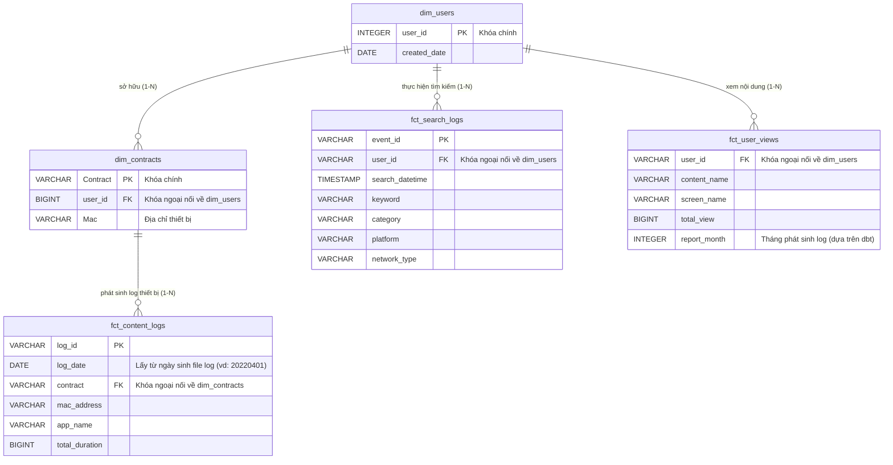

```mermaid
erDiagram
    %% Định nghĩa các mối quan hệ (Relationships)
    dim_users ||--o{ dim_contracts : "sở hữu (1-N)"
    dim_users ||--o{ fct_search_logs : "thực hiện tìm kiếm (1-N)"
    dim_users ||--o{ fct_user_views : "xem nội dung (1-N)"
    dim_contracts ||--o{ fct_content_logs : "phát sinh log thiết bị (1-N)"

    %% Định nghĩa các bảng (Tables) và cấu trúc cột
    dim_users {
        INTEGER user_id PK "Khóa chính"
        DATE created_date
    }

    dim_contracts {
        VARCHAR Contract PK "Khóa chính"
        BIGINT user_id FK "Khóa ngoại nối về dim_users"
        VARCHAR Mac "Địa chỉ thiết bị"
    }

    fct_search_logs {
        VARCHAR event_id PK
        VARCHAR user_id FK "Khóa ngoại nối về dim_users"
        TIMESTAMP search_datetime
        VARCHAR keyword
        VARCHAR category
        VARCHAR platform
        VARCHAR network_type
    }

    fct_content_logs {
        VARCHAR log_id PK
        DATE log_date "Lấy từ ngày sinh file log (vd: 20220401)"
        VARCHAR contract FK "Khóa ngoại nối về dim_contracts"
        VARCHAR mac_address
        VARCHAR app_name
        BIGINT total_duration
    }

    fct_user_views {
        VARCHAR user_id FK "Khóa ngoại nối về dim_users"
        VARCHAR content_name
        VARCHAR screen_name
        BIGINT total_view
        INTEGER report_month "Tháng phát sinh log (dựa trên dbt)"
    }
```