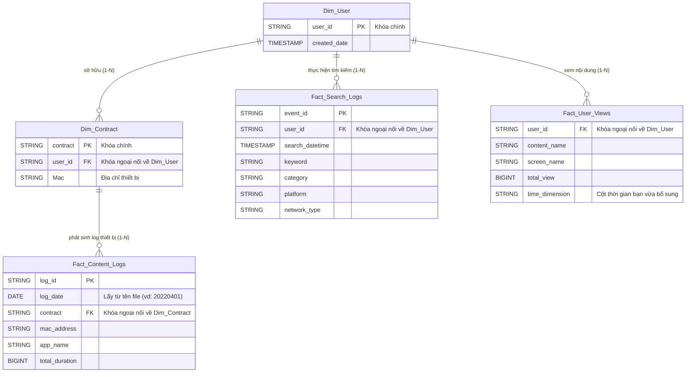

```mermaid
erDiagram
    %% Định nghĩa các mối quan hệ (Relationships)
    Dim_User ||--o{ Dim_Contract : "sở hữu (1-N)"
    Dim_User ||--o{ Fact_Search_Logs : "thực hiện tìm kiếm (1-N)"
    Dim_User ||--o{ Fact_User_Views : "xem nội dung (1-N)"
    Dim_Contract ||--o{ Fact_Content_Logs : "phát sinh log thiết bị (1-N)"

    %% Định nghĩa các bảng (Tables) và cấu trúc cột
    Dim_User {
        STRING user_id PK "Khóa chính"
        TIMESTAMP created_date
    }

    Dim_Contract {
        STRING contract PK "Khóa chính"
        STRING user_id FK "Khóa ngoại nối về Dim_User"
        STRING Mac "Địa chỉ thiết bị"
    }

    Fact_Search_Logs {
        STRING event_id PK
        STRING user_id FK "Khóa ngoại nối về Dim_User"
        TIMESTAMP search_datetime
        STRING keyword
        STRING category
        STRING platform
        STRING network_type
    }

    Fact_Content_Logs {
        STRING log_id PK
        DATE log_date "Lấy từ tên file (vd: 20220401)"
        STRING contract FK "Khóa ngoại nối về Dim_Contract"
        STRING mac_address
        STRING app_name
        BIGINT total_duration
    }

    Fact_User_Views {
        STRING user_id FK "Khóa ngoại nối về Dim_User"
        STRING content_name
        STRING screen_name
        BIGINT total_view
        STRING time_dimension "Cột thời gian bạn vừa bổ sung"
    }
```